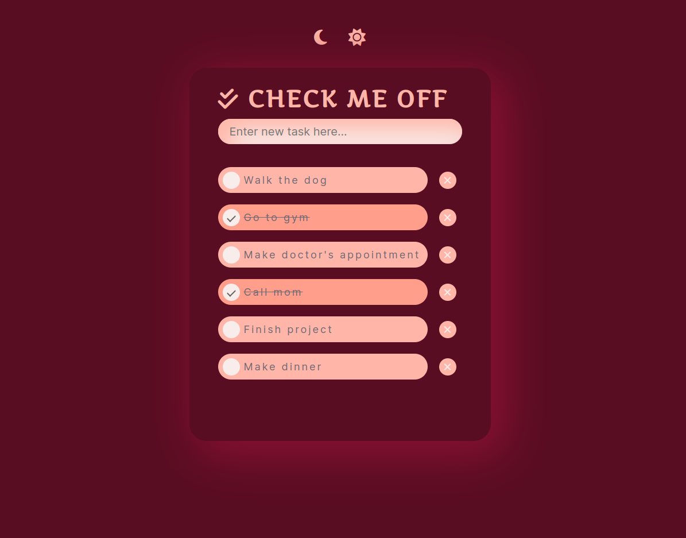

# Check Me Off - To Do App

## About The Project
Check Me Off is a CRUD app that would allow a user to create tasks, check them off and then delete each task. I was able to use JavaScript to create toggle buttons to switch between dark and light mode on the app.

### Built With
* HTML
* CSS
* JavaScript

## Acknowledgements
* [W3 Schools](https://www.w3schools.com/)
* [Font Awesome](https://fontawesome.com/)
* [Google Fonts](https://fonts.google.com/)

## Author
- Kendra Ward - [@KNWard](https://github.com/KNWard)